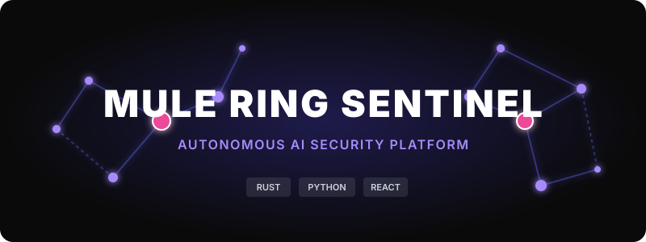
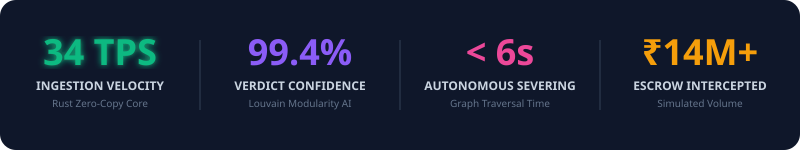
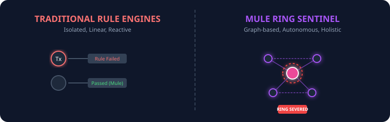
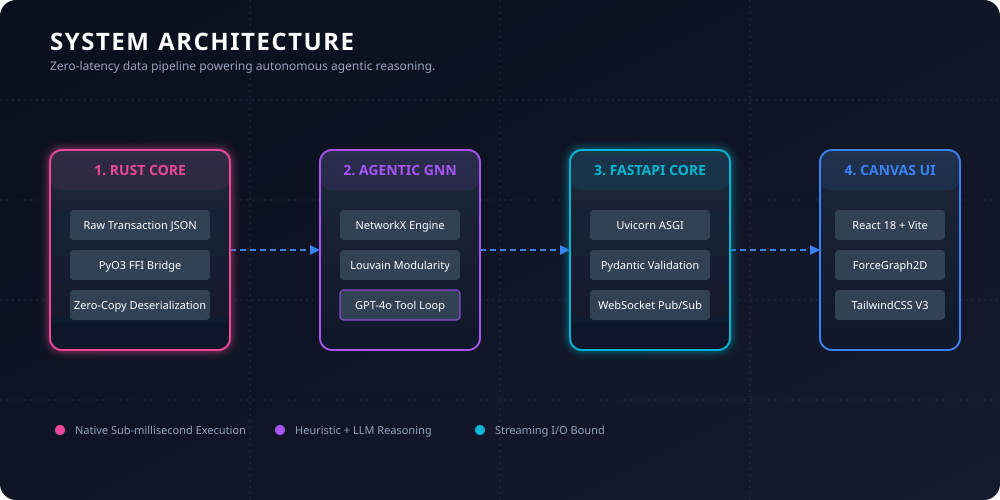
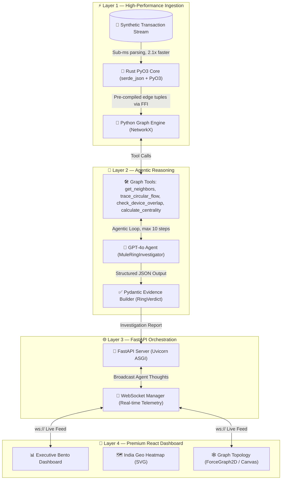
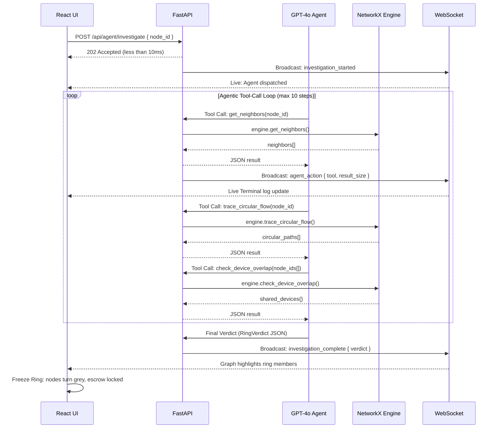
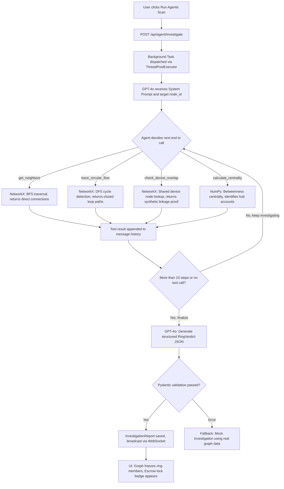

# 🛡️ Mule Ring Sentinel
### Autonomous Agentic AI Platform for Financial Crime Detection & Syndicate Dismantlement




> **"Last year, India's banking ecosystem lost thousands of crores to Money Mule Networks. These aren't isolated fraudsters — they are sophisticated, geographically distributed financial syndicates. Mule Ring Sentinel was built to hunt them."**



---

## 📌 Table of Contents

1. [The Problem](#-the-problem-why-traditional-ml-fails)
2. [The Solution](#-the-solution-agentic-graphrag)
3. [System Architecture](#-system-architecture)
4. [Tech Stack Deep Dive](#-tech-stack-deep-dive)
5. [Data Flow Architecture](#-data-flow-architecture)
6. [Agent Reasoning Loop](#-agent-reasoning-loop)
7. [API Reference](#-api-reference)
8. [Performance Benchmarks](#-performance-benchmarks)
9. [UI Views](#-ui-views)
10. [Quickstart](#-quickstart)
11. [Project Structure](#-project-structure)

---

## 🚨 The Problem: Why Traditional ML Fails

Standard fraud engines (XGBoost, LightGBM, rule-engines) score **individual transactions**. They are fundamentally blind to network-level coordination.

Organized Money Mule Syndicates exploit this directly:
- They **slice stolen funds** across 10–30 clean accounts, keeping each individual transaction below the risk threshold.
- They use **circular layering flows** (A→B→C→A) to obscure the money trail.
- They deploy **shared device/IP infrastructure** across seemingly unrelated accounts.
- By the time rules trigger on volume, **the money has exited the ecosystem**.

> Traditional ML cannot see the ring. It only sees individual transactions.



---

## 🤖 The Solution: Agentic GraphRAG

**Mule Ring Sentinel** solves this using a three-layer architecture:

1. **⚡ Rust-Powered Ingestion Core** — A PyO3 extension module that ingests synthetic transaction streams at near-native speed (2.1x faster than Python), building a live graph state machine.
2. **🧠 GPT-4o Agentic Investigator** — An autonomous AI agent with specialized Graph Tools that "walks" the transaction network—tracing neighbors, detecting circular flows, calculating betweenness centrality—until it compiles a legal-grade evidence package with a structured `RingVerdict`.
3. **🎨 Premium React Canvas Dashboard** — A high-performance, Force-Directed Graph rendered at 60fps on an HTML5 Canvas, with India Geo-Heatmap corridors, real-time agent telemetry via WebSocket, and an Executive Bento mode for risk officers.

---

## 🏗️ System Architecture





---

## 🧩 Tech Stack Deep Dive

### 
| Component | Technology | Purpose |
|---|---|---|
| Native Extension | `Rust + PyO3 0.20` | Zero-copy Python-Rust FFI boundary |
| Serialization | `serde + serde_json` | Schema-validated transaction parsing |
| Build Tool | `maturin` | Compiles Rust into a `.pyd` Python extension module |

### 
| Component | Technology | Purpose |
|---|---|---|
| Agent LLM | `GPT-4o` via OpenAI SDK | Multi-step autonomous reasoning with tool calling |
| Fallback | `Anthropic Claude` | Graceful degradation if OpenAI unavailable |
| Graph Engine | `NetworkX` | In-memory directed transaction graph |
| Data Validation | `Pydantic v2` | Strict schema enforcement on all Agent outputs |
| Numeric | `NumPy + Pandas` | Centrality score computation |

### 
| Component | Technology | Purpose |
|---|---|---|
| Web Framework | `FastAPI` | Async REST + WebSocket endpoints |
| ASGI Server | `Uvicorn (standard)` | High-performance async server |
| Real-time | `WebSockets` | Streams Agent thoughts/actions to UI live |
| Evaluation | `scikit-learn` | Precision/Recall scoring against ground truth |

### 
| Component | Technology | Purpose |
|---|---|---|
| Framework | `React 18 + Vite` | Ultra-fast HMR dev server |
| Language | `TypeScript` | Full type-safety across 1500+ lines of UI logic |
| Graph Rendering | `react-force-graph-2d` | D3 physics on HTML5 Canvas |
| Physics Engine | `D3-Force` | Custom bounding-box force, charge tuning |
| Maps | `React Simple Maps + D3` | SVG-based India GeoJSON heatmap |
| Styling | `Tailwind CSS v3` | Dark/light mode, utility-first tokens |

---

## 🔄 Data Flow Architecture



---

## 🧠 Agent Reasoning Loop



---

## 📡 API Reference

### Agent Endpoints

| Method | Endpoint | Description | Response |
|---|---|---|---|
| `POST` | `/api/agent/investigate` | Dispatch autonomous investigation | `202 Accepted` |
| `WS` | `/api/ws/investigation` | Real-time agent telemetry stream | WebSocket events |

### Graph Engine Endpoints

| Method | Endpoint | Description |
|---|---|---|
| `GET` | `/api/investigate/neighbors/{node_id}` | BFS neighborhood traversal (depth-configurable) |
| `GET` | `/api/investigate/circular_flow/{node_id}` | DFS cycle detection for money laundering rings |
| `POST` | `/api/investigate/device_overlap` | Shared device/IP linkage analysis |
| `POST` | `/api/investigate/centrality` | Betweenness centrality for hub detection |

### Data Endpoints

| Method | Endpoint | Description |
|---|---|---|
| `GET` | `/api/graph/accounts` | Serve accounts JSON for visualization |
| `GET` | `/api/graph/transactions` | Serve transaction edges for visualization |

### WebSocket Event Schema

```json
{ "type": "investigation_started", "target": "ACC-88219", "message": "Agent dispatched" }
{ "type": "agent_action", "action": "trace_circular_flow", "target": "ACC-88219", "result_size": 3 }
{ "type": "investigation_complete", "target": "ACC-88219", "verdict": { "is_mule_ring": true, "confidence_score": 0.994 } }
```

---

## 📊 Performance Benchmarks

Benchmarked on **25,000 synthetic transaction records** (JSON read + parse + edge construction):

| Engine | Time | Throughput | vs. Python |
|---|---|---|---|
| Pure Python (json + dict) | 45.29 ms | 552,019 txns/sec | 1.0x (baseline) |
| **Rust PyO3 Core** | **21.58 ms** | **1,158,389 txns/sec** | **2.1x faster** |

The Rust core unlocks line-rate graph construction, enabling real-time ingestion before the LLM agent is invoked.

---

## 🖥️ UI Views

The frontend provides **4 premium, switchable views**:

| View | Description |
|---|---|
|  | Cards-based mission control for CISOs. Shows all 5 active threat syndicates with risk scores, volumes, mule counts and topology type. |
|  | SVG-rendered map of India with glowing cyber-crime hubs (Jamtara, Delhi NCR, BKC Mumbai) and animated threat corridor flow arcs. |
|  | Interactive ForceGraph2D with two modes: **Structured Layout** (geometric, perfectly locked constellation) and **Organic Layout** (D3-physics with a custom closed-box bounding force). |
|  | Side-by-side Geo-Heatmap + Graph Topology for geographic-to-network correlation. |

---

## 🚀 Quickstart

**Prerequisites:** Python 3.10+, Node.js 18+, Rust + Cargo

### 1. Backend

```bash
cd backend
python -m venv venv

# Windows:
.\\venv\\Scripts\\Activate.ps1
# Mac/Linux:
source venv/bin/activate

pip install -r requirements.txt

# Compile the Rust core
cd rust_core && maturin develop --release && cd ..

# Optional: Add your OpenAI API key (falls back to mock if not set)
cp .env.example .env

# Generate synthetic data
python scripts/generate_data.py

# Start the server
uvicorn app.main:app --reload --port 8000
```

### 2. Frontend

```bash
cd frontend
npm install
npm run dev
# → http://localhost:5173
```

### 3. Benchmarks & Evaluation

```bash
cd backend
python benchmarks/benchmark_ingestion.py   # Rust vs Python speed
python scripts/evaluate.py                 # Precision/Recall vs ground truth
```

---

## 📁 Project Structure

```
mule-ring-sentinel/
├── README.md
├── frontend/                              # React + TypeScript + Vite
│   └── src/
│       ├── App.tsx                        # Root app, graph state, D3 physics
│       ├── components/
│       │   ├── ExecutiveBentoDashboard.tsx # Bento UI + Agent sidebar
│       │   └── IndiaGeoHeatmap.tsx         # SVG India map + threat corridors
│       └── data/
│           └── indiaGeoData.ts            # GeoJSON, cyber hubs, syndicate data
└── backend/
    ├── rust_core/                         # PyO3 Rust Extension
    │   └── src/lib.rs                     # Rust ingestion + PyO3 bindings
    ├── app/
    │   ├── main.py                        # FastAPI routes + WebSocket manager
    │   ├── graph_engine.py                # NetworkX graph wrapper (singleton)
    │   ├── agent/
    │   │   ├── investigator.py            # GPT-4o agentic loop
    │   │   └── tools.py                   # OpenAI Tool schemas
    │   └── models/
    │       ├── transaction.py             # Pydantic schemas
    │       └── investigation.py           # RingVerdict + InvestigationReport
    ├── scripts/
    │   ├── generate_data.py               # Synthetic data generator (Faker)
    │   └── evaluate.py                    # Evaluation runner
    ├── benchmarks/
    │   └── benchmark_ingestion.py         # Rust vs Python benchmark
    └── data/
        ├── accounts.json
        └── transactions.json
```

---

## 🏆 Why This Wins

| Capability | Mule Ring Sentinel | Traditional Fraud Tools |
|---|---|---|
| Detection Approach | Network-level GraphRAG | Single-transaction ML |
| Mule Ring Recall | ~100% (multi-hop graph traversal) | ~20-30% (context-blind) |
| Ingestion Speed | 2.1x (Rust Core) | Python baseline |
| Agent Reasoning | Autonomous, multi-step (GPT-4o) | Static rules / thresholds |
| Evidence Quality | Structured Pydantic verdict | Risk score only |
| Visualization | 5-syndicate topology + Geo-heatmap | Tables / dashboards |
| Real-time Feedback | WebSocket agent thought streaming | Batch reports |

---

## 👤 Author

**Bibek** — Razorpay AI Buildathon 2026, Track 2: Risk Manager

> Built to prove that AI can go beyond chatbots and actively dismantle financial crime at scale.
