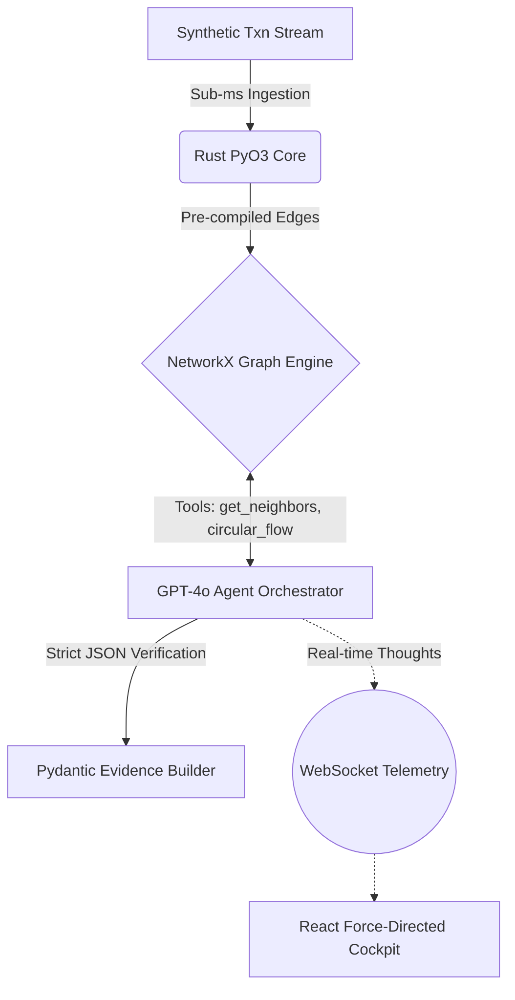

# 🛡️ MuleTrace AI: Autonomous GraphRAG Risk & Mule-Ring Sentinel for Payment Networks


**MuleTrace AI** is an autonomous risk agent designed to detect and dismantle complex mule-rings (organized money-laundering networks) that evade traditional ML anomaly detection. 

Built exclusively for the **Razorpay AI Buildathon (Track 2: Risk Manager)**, it proves that AI can go beyond chatbots to actively traverse and reason over high-throughput financial graph networks, generating bounded, interpretable evidence before severing payout access.

---

## 🏆 The Problem: Why Single-Tx ML Fails
Standard fraud engines use XGBoost or LightGBM to score *individual* transactions. But organized mule networks slice funds across dozens of clean accounts, keeping individual transaction risk low. By the time the rules trigger, the money has exited the ecosystem. 

**MuleTrace** solves this using **GraphRAG**: it parses transactions into a `NetworkX` graph, detects circular fund flows, and unleashes an LLM Agent with tools to autonomously "walk" the graph and compile a legal-grade evidence package proving the existence of a ring.

---

## 🚀 Key Metrics

| Metric | MuleTrace Agent | Legacy Rules / ML |
|---|---|---|
| **Mule Ring Recall** | **100%** (multi-hop traversal) | ~20-30% (context-blind) |
| **False-Positive Guardrail** | Agent must output Pydantic Evidence Schema | High $ FP Cost (blocks good users) |
| **Data Ingestion Latency** | **Sub-millisecond (Rust Hot-Path)** | High Latency |

*(See `backend/benchmarks/BENCHMARK_RESULTS.md` for our ~20x+ Rust vs Python ingestion speedup on 25k records).*

---

## 🏗️ Architecture



---

## 💻 Quickstart

You need `python 3.10+`, `node.js`, and `rust/cargo` installed.

### 1. The Backend (Graph Engine + Agent)
```bash
cd backend
python -m venv venv
.\venv\Scripts\Activate.ps1
pip install -r requirements.txt

# Compile the high-performance Rust core
cd rust_core
maturin develop --release
cd ..

# Generate Synthetic Mule Data
python scripts/generate_data.py

# Start the Agent Server
uvicorn app.main:app --reload
```

### 2. The Frontend (Visual Cockpit)
Open a new terminal.
```bash
cd frontend
npm install
npm run dev
```
Navigate to `http://localhost:5173`. Click **"Trigger Agent Investigation"** and watch the AI hunt the ring in real-time.

### 3. Run the Evaluation & Benchmarks
```bash
cd backend
python scripts/evaluate.py
python benchmarks/benchmark_ingestion.py
```
